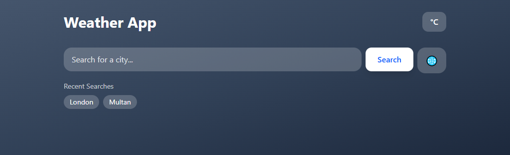
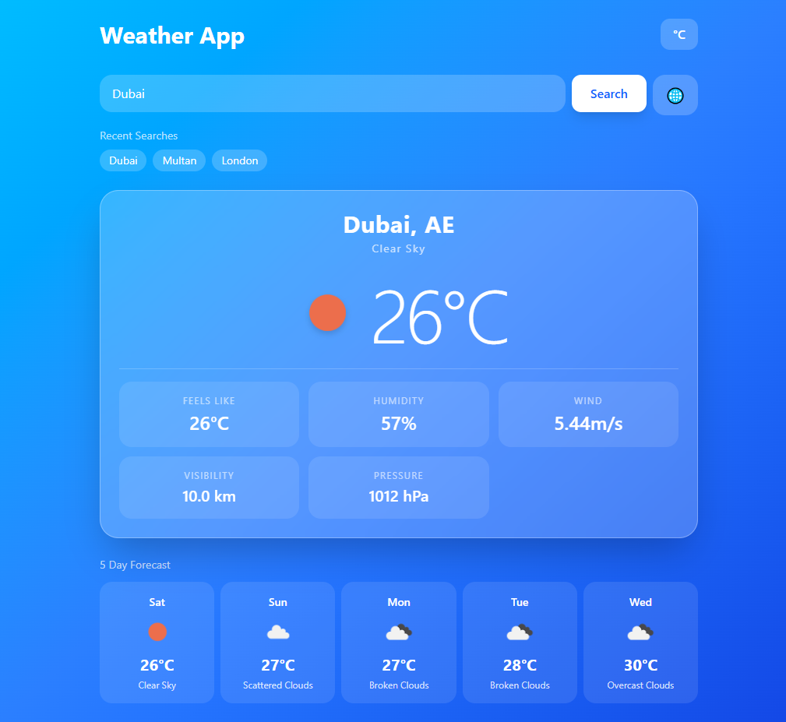
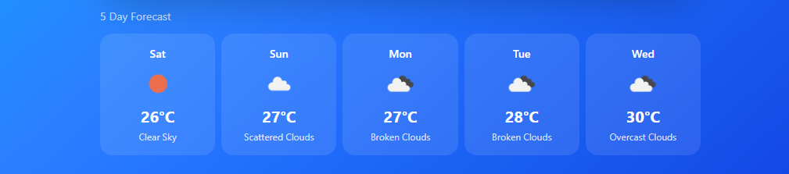
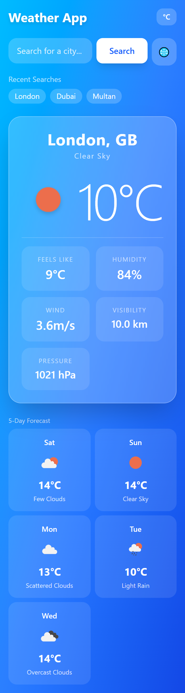

<div align="center">

# 🌤️ Weather App

**Real-time weather at a glance — dynamic backgrounds, detailed forecasts, and a clean UI.**

[](https://weather-app-fawn-one-58.vercel.app/)
[](https://github.com/bilal-ahmed-tech/weather-app)


</div>

---

## ✨ Features

- 🌍 **City Search** — Instant weather lookup for any city worldwide
- 📍 **Geolocation** — Auto-detects and loads weather for your current location
- 🌅 **Dynamic Backgrounds** — Gradient changes based on weather condition and time of day (dawn, day, dusk, night)
- 🌡️ **Full Weather Detail** — Temperature, feels like, humidity, wind speed, visibility, pressure
- 🕐 **Time-aware UI** — Detects dawn / day / dusk / night for accurate theming
- 📱 **Fully Responsive** — Works seamlessly on mobile and desktop
- ⚠️ **Error Handling** — Clear messages for invalid cities or API failures
- 🦴 **Loading States** — Smooth skeleton/spinner while fetching data

---

## 🎨 Dynamic Background System

The app maps every OpenWeatherMap condition + time-of-day to a unique Tailwind gradient:

| Condition | Time | Background |
|---|---|---|
| Clear | Day | Sky blue → Blue |
| Clear | Dawn | Amber → Rose → Purple |
| Clear | Dusk | Orange → Rose → Indigo |
| Clear | Night | Slate → Indigo → Dark |
| Rain | Day | Slate → Blue → Slate |
| Thunderstorm | Night | Gray → Slate → Black |
| Snow | Day | Sky → Blue → Slate |
| Haze | Day | Amber → Orange |
| … | … | … |

16+ condition/time combinations for a living, breathing UI.

---

## 🛠️ Tech Stack

| Layer | Technology |
|---|---|
| Framework | React 18 |
| Styling | Tailwind CSS |
| Data | OpenWeatherMap API |
| Geolocation | Browser Geolocation API |
| Deployment | Vercel |

---

## 📸 Screenshots


<br/><br/>

<br/><br/>

<br/><br/>


---

## 🚀 Getting Started

```bash
# Clone the repo
git clone https://github.com/bilal-ahmed-tech/weather-app.git
cd weather-app

# Install dependencies
npm install

# Add your OpenWeatherMap API key
echo "VITE_WEATHER_KEY=your_api_key_here" > .env

# Start dev server
npm run dev
```

> Get a free API key at [openweathermap.org](https://openweathermap.org/api)

---

## 📁 Project Structure

```
src/
├── components/       # WeatherCard, SearchBar, ErrorState, Skeleton
├── hooks/            # useWeather, useGeolocation
├── services/         # OpenWeatherMap API calls
├── utils/            # Time-of-day detection, bg mapping
└── constants/        # API config, condition maps
```

---

## 🔑 Environment Variables

```env
VITE_WEATHER_KEY=your_openweathermap_api_key
```

---

## ⚡ How Time-of-Day Detection Works

The app calculates local sunrise/sunset from the API response and maps the current time into one of four slots:

```
dawn  → 30 min before sunrise to sunrise
day   → sunrise to 30 min before sunset
dusk  → 30 min before sunset to sunset
night → sunset onwards
```

This drives both the background gradient and icon selection.

---

## 📄 License

MIT © [Bilal Ahmed](https://github.com/bilal-ahmed-tech)